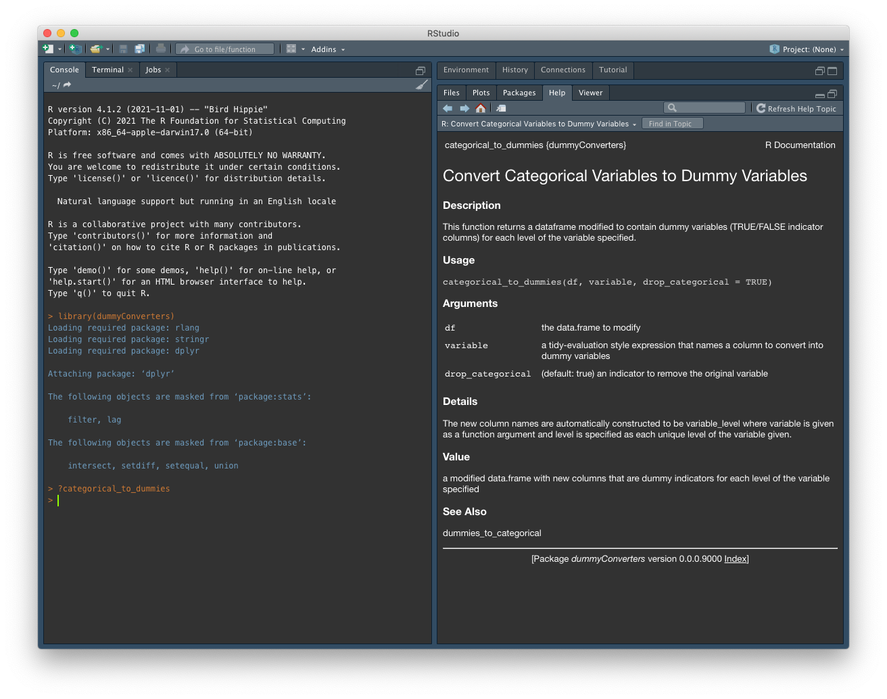
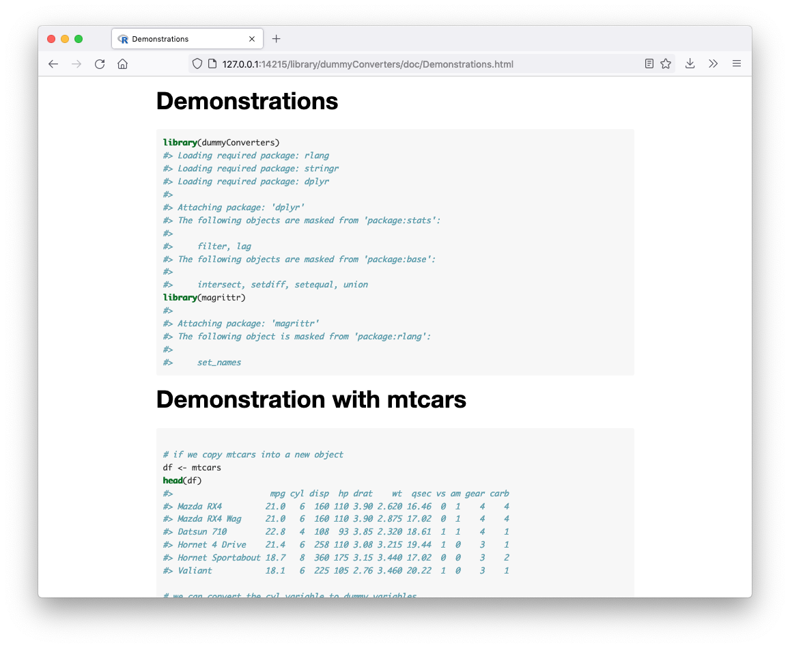

# Converting Categorical Variables to Dummy Variables and Vice-Versa

`dummyConverters` is a simple package with two functions,
`categorical_to_dummies` and `dummies_to_categorical`, which serve to help R
users to convert categorical data frame variables into dummy variables and
vice-versa. Dummy variables are columns of data which are made true/false
indicators for a particular level of a categorical variable.

### Installing 

```r
library(devtools)

devtools::install_github("ctesta01/dummyConverters", build_vignettes = TRUE)
```

## Simple Usage

```r
library(dummyConverters)
mtcars <- categorical_to_dummies(mtcars, cyl)

head(mtcars)
```

```
##                    mpg disp  hp drat    wt  qsec vs am gear carb cyl_6 cyl_4 cyl_8
## Mazda RX4         21.0  160 110 3.90 2.620 16.46  0  1    4    4  TRUE FALSE FALSE
## Mazda RX4 Wag     21.0  160 110 3.90 2.875 17.02  0  1    4    4  TRUE FALSE FALSE
## Datsun 710        22.8  108  93 3.85 2.320 18.61  1  1    4    1 FALSE  TRUE FALSE
## Hornet 4 Drive    21.4  258 110 3.08 3.215 19.44  1  0    3    1  TRUE FALSE FALSE
## Hornet Sportabout 18.7  360 175 3.15 3.440 17.02  0  0    3    2 FALSE FALSE  TRUE
## Valiant           18.1  225 105 2.76 3.460 20.22  1  0    3    1  TRUE FALSE FALSE
```

```r
# and we can convert it back 
mtcars <- dummies_to_categorical(mtcars, cyl) 

# if we want to specify the original ordering, we can
mtcars <- select(mtcars, mpg, cyl, everything())

# pay attention that the version converted back will be a character vector
mtcars$cyl %<>% as.numeric()
head(mtcars)
```


```
##                    mpg cyl disp  hp drat    wt  qsec vs am gear carb
## Mazda RX4         21.0   6  160 110 3.90 2.620 16.46  0  1    4    4
## Mazda RX4 Wag     21.0   6  160 110 3.90 2.875 17.02  0  1    4    4
## Datsun 710        22.8   4  108  93 3.85 2.320 18.61  1  1    4    1
## Hornet 4 Drive    21.4   6  258 110 3.08 3.215 19.44  1  0    3    1
## Hornet Sportabout 18.7   8  360 175 3.15 3.440 17.02  0  0    3    2
## Valiant           18.1   6  225 105 2.76 3.460 20.22  1  0    3    1
```

### Read the function documentation 

You can access documentation for either function using the `?` or `help()`
commands in R after you've installed the package.

```r
?categorical_to_dummies
?dummies_to_categorical
```




### Read the examples 

You can access the package vignettes if you run the following command.

```r
browseVignettes("dummyConverters")
```



The vignette shows a similar example but using the `magrittr` package's
`%<>%` pipe, and it would be similar syntax to use these functions with the
`%>%` or `|>` pipes.


